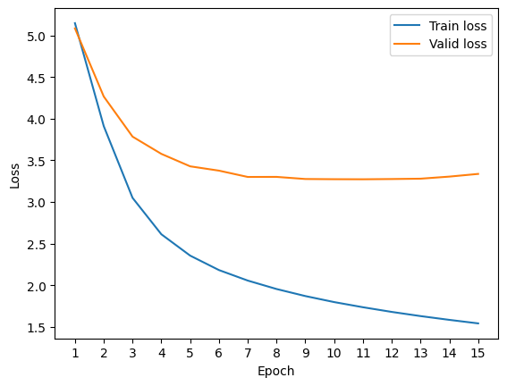

# LSTM-Attention-English-to-French-Translation
LSTM-Attention-Transformer English to French Translation


#### Name: Akshay Parate


```python
import sys

def print_line(*args):
    """ Inline print and go to the begining of line
    """
    args1 = [str(arg) for arg in args]
    str_ = ' '.join(args1)
    print('\r' + str_, end='')
```


```python
import tensorflow as tf

# If you are going to use GPU, make sure the GPU in in the output
tf.config.list_physical_devices('GPU')
```


    [PhysicalDevice(name='/physical_device:GPU:0', device_type='GPU')]


```python
from typing import List, Tuple, Union, Dict
import numpy as np
```

## 1. Data preparation

### 1.1 Load and describe data

Here, we use the [iwslt2017](https://huggingface.co/datasets/iwslt2017) dataset. More specifically, this translation task is from French to English: fr-en.


```python
import os
from datasets import load_dataset
# The load_dataset function is provided by the huggingface datasets
# https://huggingface.co/docs/datasets/index

dataset_path = os.path.join('a4-data', 'dataset')
# Loading the training set, the validation set, and the test set
dataset = load_dataset('iwslt2017', 'iwslt2017-en-fr', cache_dir=dataset_path, ignore_verifications=True)
```

    C:\Users\Akshay\anaconda3\envs\tensorflow\lib\site-packages\tqdm\auto.py:21: TqdmWarning: IProgress not found. Please update jupyter and ipywidgets. See https://ipywidgets.readthedocs.io/en/stable/user_install.html
      from .autonotebook import tqdm as notebook_tqdm
    C:\Users\Akshay\anaconda3\envs\tensorflow\lib\site-packages\datasets\load.py:2524: FutureWarning: 'ignore_verifications' was deprecated in favor of 'verification_mode' in version 2.9.1 and will be removed in 3.0.0.
    You can remove this warning by passing 'verification_mode=no_checks' instead.
      warnings.warn(
    


```python
# Statistics of dataset
print(f"DATASET:\n {dataset}\n")
print(f"Length of training dataset: {len(dataset['train']['translation'])}\n\
Length of validation dataset: {len(dataset['validation']['translation'])}\n\
Length of test dataset: {len(dataset['test']['translation'])}")
```

    DATASET:
     DatasetDict({
        train: Dataset({
            features: ['translation'],
            num_rows: 232825
        })
        test: Dataset({
            features: ['translation'],
            num_rows: 8597
        })
        validation: Dataset({
            features: ['translation'],
            num_rows: 890
        })
    })
    
    Length of training dataset: 232825
    Length of validation dataset: 890
    Length of test dataset: 8597
    


```python
# Example from the dataset
print(f"English: {dataset['train']['translation'][0]['en']}\nFrench: {dataset['train']['translation'][0]['fr']}")
```

    English: Thank you so much, Chris. And it's truly a great honor to have the opportunity to come to this stage twice; I'm extremely grateful.
    French: Merci beaucoup, Chris. C'est vraiment un honneur de pouvoir venir sur cette scène une deuxième fois. Je suis très reconnaissant.
    


```python
from tokenizers import Tokenizer


en_tokenizer = Tokenizer.from_file("a4-data/en_tokenizer.json")
fr_tokenizer = Tokenizer.from_file("a4-data/fr_tokenizer.json")
```


```python
# Example of encoding a sentence into tokens and ids
encoding = en_tokenizer.encode("i like sports.")
print(f"Encoded IDs: {encoding.ids}")
print(f"Encoded Tokens: {encoding.tokens}")
```

    Encoded IDs: [0, 122, 279, 4987, 17, 1]
    Encoded Tokens: ['<s>', 'Ġi', 'Ġlike', 'Ġsports', '.', '</s>']
    


```python
# Extracting English and French sentences for training, validation, and test sets (in lower-case)
train_en_sentences = [sent['en'].lower() for sent in dataset['train']['translation']]
train_fr_sentences = [sent['fr'].lower() for sent in dataset['train']['translation']]
valid_en_sentences = [sent['en'].lower() for sent in dataset['validation']['translation']]
valid_fr_sentences = [sent['fr'].lower() for sent in dataset['validation']['translation']]
test_en_sentences = [sent['en'].lower() for sent in dataset['test']['translation']]
test_fr_sentences = [sent['fr'].lower() for sent in dataset['test']['translation']]
```

### 1.2 Encode data into token ids


```python
def encode(tokenizer: 'Tokenizer', sentences: List[str]) -> List[List[int]]:
    """ Encode the sentences with the pretrained tokenizer.
        You can directly call `tokenizer.encode()` to encode the sentences.
        It will automatically add the <s> and </s> token.

        Note: Please be carefull with the return value of the encode function.

    Args:
        tokenizer: A pretrained en/fr tokenizer
        sentences: A list of strings
    Return:
        sent_token_ids: A list of token ids
    """
    sent_token_ids = []
    n = len(sentences)
    for i, sentence in enumerate(sentences):
        if i % 100 == 0 or i == n - 1:
            print_line('Encoding with Tokenizer:', (i + 1), '/', n)
        # Start your code here
        sent_token_ids.append(tokenizer.encode(sentence).ids)
        # End
    print_line('\n')
    return sent_token_ids
```


```python
print('en')
train_en = encode(en_tokenizer, train_en_sentences)
valid_en = encode(en_tokenizer, valid_en_sentences)
test_en = encode(en_tokenizer, test_en_sentences)
print('fr')
train_fr = encode(fr_tokenizer, train_fr_sentences)
valid_fr = encode(fr_tokenizer, valid_fr_sentences)
test_fr = encode(fr_tokenizer, test_fr_sentences)
```

    en
    Encoding with Tokenizer: 232825 / 232825
    Encoding with Tokenizer: 890 / 890
    Encoding with Tokenizer: 8597 / 8597
    fr
    Encoding with Tokenizer: 232825 / 232825
    Encoding with Tokenizer: 890 / 890
    Encoding with Tokenizer: 8597 / 8597
    


```python
print(dataset['train']['translation'][0])
print(train_en[0], train_fr[0])
print(en_tokenizer.decode(train_en[0]), fr_tokenizer.decode(train_fr[0]))
```

    {'en': "Thank you so much, Chris. And it's truly a great honor to have the opportunity to come to this stage twice; I'm extremely grateful.", 'fr': "Merci beaucoup, Chris. C'est vraiment un honneur de pouvoir venir sur cette scène une deuxième fois. Je suis très reconnaissant."}
    [0, 658, 162, 188, 494, 15, 2843, 17, 138, 165, 178, 2775, 121, 630, 4502, 140, 222, 124, 1930, 140, 625, 140, 185, 2122, 3446, 30, 122, 400, 2576, 5818, 17, 1] [0, 763, 478, 15, 3016, 17, 145, 10, 178, 487, 169, 8981, 152, 1038, 2055, 266, 323, 2425, 220, 1760, 586, 17, 214, 459, 378, 9952, 17, 1]
     thank you so much, chris. and it's truly a great honor to have the opportunity to come to this stage twice; i'm extremely grateful.  merci beaucoup, chris. c'est vraiment un honneur de pouvoir venir sur cette scène une deuxième fois. je suis très reconnaissant.
    

## 2. Sequence to sequence model

### 2.1 Encoder


```python
from tensorflow.keras.models import Model
from tensorflow.keras.layers import Layer, GRU, Dense, Embedding, Dropout
from tensorflow.keras.initializers import GlorotUniform


class Encoder(Model):
    def __init__(self, vocab_size: int, embedding_size: int, units: int):
        """ The encoder model for the src sentences.
            It contains an embedding part and a GRU part.

        Args:
            vocab_size: The src vocabulary size
            embedding_size: The embedding size for the embedding layer
            units: Number of hidden units in the RNN (GRU) layer
        """
        super().__init__()
        # Start your code here
        # Note: Please know what the decoder needs from encoder. This determines the parameters of the GRU layer
        self.embedding = Embedding(vocab_size, embedding_size)
        self.gru = GRU(units, return_sequences=True, return_state=True, recurrent_initializer='glorot_uniform')
        # End

    def call(self, src_ids, src_mask):
        """ Encoder forward
        Args:
            src_ids: Tensor, (batch_size x max_len), the token ids of input sentences in a batch
            src_mask: Tensor, (batch_size x max_len), the mask of the src input. True value in the mask means this timestep is valid, otherwise this timestep is ignored
        Returns:
            enc_output: Tensor, (batch_size x max_len x units), the output of GRU for all timesteps
            final_state: Tensor, (batch_size x units), the state of the final valid timestep
        """
        # Start your code here
        # Step 1. Retrieve embedding
        #      2. GRU
        # Please refer to the calling arguments of GRU: https://www.tensorflow.org/api_docs/python/tf/keras/layers/GRU#call-arguments
        # print(src_ids)
        # print(src_ids[0])
        # print()
        embedded = self.embedding(src_ids)
        # print(embedded)
        enc_outputs, final_state = self.gru(embedded, mask=src_mask)
        # End
        return enc_outputs, final_state
```

### 2.4 Seq2seq loss


```python
from tensorflow_addons.seq2seq import sequence_loss


def seq2seq_loss(logits, target, seq_lens):
    """ Calculate the sequence to sequence loss using the sequence_loss from tensorflow
    
    Args:
        logits: Tensor (batch_size x max_seq_len x vocab_size). The output of the RNN model.
        target: Tensor (batch_size x max_seq_len). The groud-truth of words.
        seq_lens: Tensor (batch_size, ). The real sequence length before padding.
    """
    loss = 0
    # Start your code here
    # 1. make a sequence mask (batch_size x max_seq_len) using tf.sequence_mask. This is to build a mask with 1 and 0.
    #    Entry with 1 is the valid time step without padding. Entry with 0 is the time step with padding. We need to exclude this time step.
    pad_mask = tf.sequence_mask(seq_lens, dtype=tf.float32)

    # 2. calculate the loss with sequence_loss. Carefully read the documentation of each parameter
    loss = sequence_loss(logits = logits,
                         targets = target,
                         weights = pad_mask,
                         average_across_timesteps = True,
                         average_across_batch = True)
    # average_across_timesteps and average_across_batch are True : 
    # loss is averaged across both the axes for each sample in the batch
    
    # End
    return loss
```

    /usr/local/lib/python3.9/dist-packages/tensorflow_addons/utils/tfa_eol_msg.py:23: UserWarning: 
    
    TensorFlow Addons (TFA) has ended development and introduction of new features.
    TFA has entered a minimal maintenance and release mode until a planned end of life in May 2024.
    Please modify downstream libraries to take dependencies from other repositories in our TensorFlow community (e.g. Keras, Keras-CV, and Keras-NLP). 
    
    For more information see: https://github.com/tensorflow/addons/issues/2807 
    
      warnings.warn(
    

## 3. Sequence to sequence model with attention

### 3.2 Decoder  (with Attention)


```python
from tensorflow.keras.models import Model
from tensorflow.keras.layers import GRU, Dense, Embedding, Dropout, Attention
from tensorflow.keras.initializers import GlorotUniform

class Decoder_Attention(Model):
    def __init__(self, vocab_size: int, embedding_size: int, units: int, dropout_rate: float):
        """ The decoder model for the tgt sentences with attention.
            It contains an embedding part, an attention part, a GRU part, a dropout part, and a classifier part.
            
        Args:
            vocab_size: The tgt vocabulary size
            embedding_size: The embedding size for the embedding layer
            units: Number of hidden units in the RNN (GRU) layer
            dropout_rate: The classifier has a (units x vocab_size) weight. This is a large weight matrix. We apply a dropout layer to avoid overfitting.
        """
        super().__init__()
        
        # Start your code here
        
        # Note: 1. Please correctly set the parameter of GRU
        #       2. No softmax here because we will need the sequence to sequence loss later
        
        # Initializing Embedding Layer
        self.embedding = Embedding(input_dim = vocab_size, output_dim = embedding_size)
        
        # Attention Layer
        self.attention = Attention(score_mode = "dot")
        
        # Initializing GRU Layer
        self.gru = GRU(units = units, return_sequences = True, recurrent_initializer = 'glorot_uniform') 
        
        # Initializing Dropout Layer
        self.drop = Dropout(rate = dropout_rate)
        
        # Initializing Output Layer (Classifier)
        self.dense = Dense(units = vocab_size)  

        # End

    def call(self, tgt_ids, initial_state, tgt_mask, encoder_outputs):
        """ Decoder forward.
            It is called by decoder(tgt_ids=..., initial_state=..., tgt_mask=...)

        Args:
            tgt_ids: Tensor, (batch_size x max_len), the token ids of input sentences in a batch
            initial_state: Tensor, (batch_size x units), the state of the final valid timestep from the encoder
            tgt_mask: Tensor, (batch_size x max_len), the mask of the tgt input. True value in the mask means this timestep is valid, otherwise this timestep is ignored
            encoder_outputs: Tensor, (batch_size x max_len x units), the output of GRU for all timesteps
        Return:
            dec_outputs: Tensor, (batch_size x max_len x vocab_size), the output of GRU for all timesteps
        """
        # Start your code here
                
        # Embedding the input (after Embedding: (batch_size x max_len x embedding_size))
        tgt_embedding = self.embedding(tgt_ids)

        # Applying the GRU layer (after GRU layer: (batch_size x max_len x units))
        tgt_hidden = self.gru(inputs = tgt_embedding, mask = tgt_mask, initial_state = initial_state)
        
        # Applying the Attention layer 
        context_vector, attention_weights = self.attention([tgt_hidden, encoder_outputs], return_attention_scores = True)
        
        # Concatenating attention output and the decoder hidden state
        attention_op_decode_hidden = tf.concat([context_vector, tgt_hidden], axis=-1)
        
        # Applying the Dropout layer (after Dropout:
        tgt_drop = self.drop(inputs = attention_op_decode_hidden)
        
        # Applying the Output layer
        dec_outputs = self.dense(tgt_drop)

        # End
        return dec_outputs
    
    def predict(self, tgt_ids, initial_state, encoder_outputs):
        """ Decoder prediction.
            This is a step in recursive prediction. We use the previous prediction and state to predict current token.
            Note that we only need to use the gru_cell instead of GRU becasue we only need to calculate one timestep.
            
        Args:
            tgt_ids: Tensor, (batch_size, ) -> (1, ), the token id of the current timestep in the current sentence.
            initial_state: Tensor, (batch_size x units) -> (1 x units), the state of the final valid timestep from the encoder or the previous hidden state in prediction.
        Return:
            dec_outputs: Tensor, (batch_size x vocab_size) -> (1 x vocab_size), the output of GRU for this timestep.
            state: Tensor, (batch_size x units) -> (1 x units), the state of this timestep.
        """
        gru_cell = self.gru.cell
        
        # Start your code here
        
        # Embedding the input (after embedding: (1 x embedding_size))
        tgt_embedding = self.embedding(tgt_ids)
        
        # Applying the GRU layer (after GRU layer: (1 x units))
        tgt_hidden, state = gru_cell(inputs = tgt_embedding, states = initial_state, training = False)

        # (1 x 1 x units)
        tgt_hidden = tf.expand_dims(tgt_hidden, axis=1)

        # Applying the Attention layer 
        context_vector, attention_weights = self.attention([tgt_hidden, encoder_outputs], training = False, return_attention_scores = True)
        context_vector = tf.squeeze(context_vector, axis=1)
        tgt_hidden = tf.squeeze(tgt_hidden, axis=1)

        # Concatenating attention output and the decoder hidden state
        attention_op_decode_hidden = tf.concat([context_vector, tgt_hidden], axis=1)

        # Applying the Output layer
        dec_outputs = self.dense(attention_op_decode_hidden)

        # End
        return dec_outputs, state
```

### 3.3 Seq2seq (with Attention)


```python
class Seq2seq_Attention(Model):
    def __init__(self, src_vocab_size: int, tgt_vocab_size: int, embedding_size: int, units: int, dropout_rate: float):
        """ The sequence to sequence model.
            It contains an encoder and a decoder.
            
        Args:
            src_vocab_size: The src vocabulary size
            tgt_vocab_size: The tgt vocabulary size
            embedding_size: The embedding size for the embedding layer
            units: Number of hidden units in the RNN (GRU) layer
            dropout_rate: The dropout rate used in the decoder.
        """
        super().__init__()
        
        # Start your code here
        
        # Initializing the encoder
        self.encoder = Encoder(vocab_size = src_vocab_size, embedding_size = embedding_size, units = units)
        
        # Initializing the decoder
        self.decoder = Decoder_Attention(vocab_size = tgt_vocab_size, embedding_size = embedding_size, units = units, dropout_rate = dropout_rate)        
        
        # End

    def call(self, src_ids, src_seq_lens, tgt_ids, tgt_seq_lens):
        """ Seq2seq forward (for the loss calculation in training/validation only).
            It is called by model(src_ids=..., src_seq_lens=..., tgt_ids=..., tgt_seq_lens=)
            Note: In prediction, we will also need to set `training=False`.

        Args:
            src_ids: Tensor, (batch_size x max_len), the token ids of src sentences in a batch
            src_seq_lens: Tensor, (batch_size, ), the length of src sentences in a batch
            tgt_ids: Tensor, (batch_size x max_len), the token ids of tgt sentences in a batch
            tgt_seq_lens: Tensor, (batch_size, ), the length of src sentences in a batch
        Returns:
            dec_outputs: Tensor, (batch_size x max_len x units), the decoder predictions
        """
        
        # Start your code here
        
        # Building a mask for source sentences
        max_src_len = tf.reduce_max(src_seq_lens)
        src_mask = tf.sequence_mask(src_seq_lens, max_src_len)
        
        # Building a mask for target sentences
        max_tgt_len = tf.reduce_max(tgt_seq_lens)
        tgt_mask = tf.sequence_mask(tgt_seq_lens, max_tgt_len)
        
        # Encoder forward
        enc_op, enc_final_state = self.encoder(src_ids, src_mask)
        
        # Decoder forward
        dec_outputs = self.decoder(tgt_ids, enc_final_state, tgt_mask, enc_op)
        
        # End
        return dec_outputs
```

## 4. Training

### 4.1 Pad batch
Pad the batch to the equal length and make tensors.


```python
def pad_src_batch(src_batch: List[List[int]], src_seq_lens: List[int], pad_val: int):
    """ Pad the batch for src sentences.
        Note: Do not use append/extend that can modify the input inplace.

    Args:
        src_batch: A list of src token ids
        src_seq_lens: A list of src lens
        pad_val: The padding value

    Returns:
        src_batch: Tensor, (batch_size x max_len)
        src_seq_lens_batch: Tensor, (batch_size, )
    """
    max_src_len = max(src_seq_lens)
    # Start your code here
    num_sent = len(src_seq_lens)
    # Please refer to tf.convert_to_tensor. The dtype should be tf.int64
    # Padding
    src_batch_padded = [sentence + [pad_val] * (max_src_len - len(sentence)) for sentence in src_batch]
    # Convert to tensor
    src_batch = tf.convert_to_tensor(src_batch_padded, dtype=tf.int64)
    src_seq_lens_batch = tf.convert_to_tensor(src_seq_lens, dtype=tf.int64)
    # End
    return src_batch, src_seq_lens_batch
```


```python
def pad_tgt_batch(tgt_batch: List[List[int]], tgt_seq_lens: List[int], pad_val: int):
    """ Pad the batch for tgt sentences.
        Note: 1. Do not use append/extend that can modify the input inplace.
              2. We need to build the x (feature) and y (label) for tgt sentences.
                 Please understand what the feature and label are in translation.

    Args:
        tgt_batch: A list of src token ids
        tgt_seq_lens: A list of src lens
        pad_val: The padding value

    Returns:
        tgt_x_batch: Tensor, (batch_size x max_len)
        tgt_y_batch: Tensor, (batch_size x max_len)
        src_seq_lens_batch: Tensor, (batch_size, )
    """
    tgt_x_batch, tgt_y_batch, tgt_seq_lens_batch = [], [], []
    for sent, seq_len in zip(tgt_batch, tgt_seq_lens):
        # Start your code here
        # Append x, y, and seq_len
        tgt_x_batch.append(sent[:-1])  # Exclude last token for y
        tgt_y_batch.append(sent[1:])   # Exclude first token for x
        tgt_seq_lens_batch.append(seq_len - 1)  # Reduce sequence length by 1 for y
        # End

    max_tgt_len = max(tgt_seq_lens_batch)
    # Start your code here
    # Please refer to tf.convert_to_tensor. The dtype should be tf.int64
    # Padding
    tgt_x_batch = [sentence + [pad_val] * (max_tgt_len - len(sentence)) for sentence in tgt_x_batch]
    tgt_y_batch = [sentence + [pad_val] * (max_tgt_len - len(sentence)) for sentence in tgt_y_batch]

    # Convert to tensor
    tgt_x_batch = tf.convert_to_tensor(tgt_x_batch, dtype=tf.int64)
    tgt_y_batch = tf.convert_to_tensor(tgt_y_batch, dtype=tf.int64)
    tgt_seq_lens_batch = tf.convert_to_tensor(tgt_seq_lens_batch, dtype=tf.int64)
    # End
    return tgt_x_batch, tgt_y_batch, tgt_seq_lens_batch
```


```python
def pad_batch(src_batch: List[List[int]], src_seq_lens: List[int], tgt_batch: List[List[int]], tgt_seq_lens: List[int], pad_val: int):
    src_batch, src_seq_lens_batch = pad_src_batch(src_batch, src_seq_lens, pad_val)
    tgt_x_batch, tgt_y_batch, tgt_seq_lens_batch = pad_tgt_batch(tgt_batch, tgt_seq_lens, pad_val)
    return src_batch, src_seq_lens_batch, tgt_x_batch, tgt_y_batch, tgt_seq_lens_batch
```

### 4.2 Batch Index Sampler

Create a index sampler to sample data index for each batch.

This is to make the sentences in each batch have similar lengths to speed up training.

Example:
```
Assume the sentence lengths are: [5, 2, 3, 6, 2, 3, 6] and batch_size is 2.
We can make the indices in the batches as follows:
[1, 4] of length 2
[2, 5] of length 3
[0, 3] of lengths 5 and 6
[6] of length 6
```


```python
class SeqLenBatchSampler:
    def __init__(self, seq_lens: List[int], batch_size: int, seed: int = 6666):
        """ The index sampler.
            It can be used with iteration:
            ```
            n_batch = len(sampler)
            for indices in sampler:
                ...
            ```

            Args:
                seq_lens: A list training sequence lengths (src)
                batch_size: .
                seed: .
        """
        np.random.seed(seed)
        self.seq_lens = seq_lens
        self.batch_size = batch_size
        self.batches = self._make_batch_index()

        self.n_batch = len(self.batches)
        self.counter = -1

    def _make_batch_index(self) -> List[List[int]]:
        """ Build the indexes in each batch.

            Return:
                batches: A list of indices batch, e.g., [[0, 2, 8], [3, 6, 4], [5, 1, 7], ...]
        """
        n = len(self.seq_lens)
        n_batch = int(np.ceil(n / self.batch_size))
        batches = []
        # Start your code here
        # Step 1. Use np.argsort to get all indices with sorted length
        #      2. Split the indices into batches using a for loop: `for i in range(n_batch):`
        sorted_indices = np.argsort(self.seq_lens)
        batches = [sorted_indices[i::n_batch] for i in range(n_batch)]
        # End
        return batches

    def __len__(self):
        return self.n_batch

    def __item__(self, index):
        return self.batches[index]

    def __iter__(self):
        np.random.shuffle(self.batches)
        self.counter = -1
        return self

    def __next__(self):
        self.counter += 1
        if self.counter < self.n_batch:
            return self.batches[self.counter]
        raise StopIteration
```

### 4.3 Running the model

Generate the length


```python
np.random.seed(6666)
train_seq_lens_en = [len(en_sent) for en_sent in train_en]
train_seq_lens_fr = [len(fr_sent) for fr_sent in train_fr]
valid_seq_lens_en = [len(en_sent) for en_sent in valid_en]
valid_seq_lens_fr = [len(fr_sent) for fr_sent in valid_fr]
test_seq_lens_en = [len(en_sent) for en_sent in test_en]
test_seq_lens_fr = [len(fr_sent) for fr_sent in test_fr]
```

Create np array


```python
train_en = np.array(train_en, dtype = object)
train_seq_lens_en = np.array(train_seq_lens_en)
train_fr = np.array(train_fr, dtype = object)
train_seq_lens_fr = np.array(train_seq_lens_fr)
```

Model parameters


```python
import random

seed = 6666
random.seed(seed)
np.random.seed(seed)
tf.random.set_seed(seed)
```


```python
src_vocab_size = len(fr_tokenizer.get_vocab())
tgt_vocab_size = len(en_tokenizer.get_vocab())
hidden_units = 256
embedding_dim = 128
dropout_rate = 0.0
```


```python
model = Seq2seq_Attention(src_vocab_size, tgt_vocab_size, embedding_dim, hidden_units, dropout_rate)
```


```python
num_epoch = 15
batch_size = 256
# num_epoch = 1
# batch_size = 32
learning_rate = 1e-3
```


```python
optimizer = tf.keras.optimizers.Adam(learning_rate = learning_rate)
train_batch_sampler = SeqLenBatchSampler(train_seq_lens_fr, batch_size)
```


```python
n_training_samples = len(train_fr)
n_valid_batch = int(np.ceil(len(valid_fr) / batch_size))
pad_token_id = fr_tokenizer.token_to_id('<pad>')
train_losses, valid_losses = [], []
for epoch in range(num_epoch):
    epoch_loss = 0.0
    for batch_idx, data_index in enumerate(train_batch_sampler):
        src_batch, src_seq_lens = train_fr[data_index], train_seq_lens_fr[data_index]

        tgt_batch, tgt_seq_lens = train_en[data_index], train_seq_lens_en[data_index]
        real_batch_size = len(src_batch)
        (src_batch, src_seq_lens_batch,
         tgt_x_batch, tgt_y_batch, tgt_seq_lens_batch) = pad_batch(src_batch, src_seq_lens,
                                                                   tgt_batch, tgt_seq_lens,
                                                                   pad_val=pad_token_id)
        with tf.GradientTape() as tape:
            # print(src_batch[0])
            # print()
            output = model(src_batch, src_seq_lens_batch, tgt_x_batch, tgt_seq_lens_batch)
            loss = seq2seq_loss(output, tgt_y_batch, tgt_seq_lens_batch)

        print_line(f'Epoch {epoch + 1} / {num_epoch} - Step {batch_idx + 1} / {len(train_batch_sampler)} - loss: {loss:.4f}')

        trainable_vars = model.trainable_variables
        gradients = tape.gradient(loss, trainable_vars)

        # Update weights
        optimizer.apply_gradients(zip(gradients, trainable_vars))
        epoch_loss += loss * real_batch_size

    valid_loss = 0.0
    for batch_idx in range(n_valid_batch):
        start = batch_idx * batch_size
        end = start + batch_size
        src_batch, src_seq_lens = valid_fr[start:end], valid_seq_lens_fr[start:end]
        tgt_batch, tgt_seq_lens = valid_en[start:end], valid_seq_lens_en[start:end]
        real_batch_size = len(src_batch)
        (src_batch, src_seq_lens_batch,
         tgt_x_batch, tgt_y_batch, tgt_seq_lens_batch) = pad_batch(src_batch, src_seq_lens,
                                                                   tgt_batch, tgt_seq_lens,
                                                                   pad_val=pad_token_id)
        output = model(src_batch, src_seq_lens_batch, tgt_x_batch, tgt_seq_lens_batch, training=False)
        loss = seq2seq_loss(output, tgt_y_batch, tgt_seq_lens_batch)

        if batch_idx % 1 == 0 or batch_idx == len(valid_en) - 1:
            print_line(f'Epoch {epoch + 1} / {num_epoch} - Step {batch_idx + 1} / {n_valid_batch} - loss: {loss:.4f}')

        valid_loss += loss * real_batch_size
    train_epoch_loss = epoch_loss / n_training_samples
    valid_epoch_loss = valid_loss / len(valid_en)
    train_losses.append(train_epoch_loss)
    valid_losses.append(valid_epoch_loss)
    print(f'\rEpoch {epoch + 1} / {num_epoch} - Step {len(train_batch_sampler)} / {len(train_batch_sampler)} - train loss: {train_epoch_loss:.4f} - valid loss: {valid_epoch_loss:.4f}')
```

    Epoch 1 / 15 - Step 910 / 910 - train loss: 5.1464 - valid loss: 5.0842
    Epoch 2 / 15 - Step 910 / 910 - train loss: 3.9108 - valid loss: 4.2661
    Epoch 3 / 15 - Step 910 / 910 - train loss: 3.0501 - valid loss: 3.7847
    Epoch 4 / 15 - Step 910 / 910 - train loss: 2.6130 - valid loss: 3.5778
    Epoch 5 / 15 - Step 910 / 910 - train loss: 2.3569 - valid loss: 3.4285
    Epoch 6 / 15 - Step 910 / 910 - train loss: 2.1836 - valid loss: 3.3767
    Epoch 7 / 15 - Step 910 / 910 - train loss: 2.0574 - valid loss: 3.3009
    Epoch 8 / 15 - Step 910 / 910 - train loss: 1.9561 - valid loss: 3.3017
    Epoch 9 / 15 - Step 910 / 910 - train loss: 1.8716 - valid loss: 3.2762
    Epoch 10 / 15 - Step 910 / 910 - train loss: 1.7994 - valid loss: 3.2739
    Epoch 11 / 15 - Step 910 / 910 - train loss: 1.7374 - valid loss: 3.2730
    Epoch 12 / 15 - Step 910 / 910 - train loss: 1.6814 - valid loss: 3.2759
    Epoch 13 / 15 - Step 910 / 910 - train loss: 1.6313 - valid loss: 3.2801
    Epoch 14 / 15 - Step 910 / 910 - train loss: 1.5859 - valid loss: 3.3051
    Epoch 15 / 15 - Step 910 / 910 - train loss: 1.5437 - valid loss: 3.3374
    


```python
model.summary(expand_nested = True)
```

    Model: "seq2seq__att"
    _________________________________________________________________
     Layer (type)                Output Shape              Param #   
    =================================================================
     encoder_1 (Encoder)         multiple                  1576448   
    |¯¯¯¯¯¯¯¯¯¯¯¯¯¯¯¯¯¯¯¯¯¯¯¯¯¯¯¯¯¯¯¯¯¯¯¯¯¯¯¯¯¯¯¯¯¯¯¯¯¯¯¯¯¯¯¯¯¯¯¯¯¯¯|
    | embedding_2 (Embedding)   multiple                  1280000   |
    |                                                               |
    | gru_2 (GRU)               multiple                  296448    |
    ¯¯¯¯¯¯¯¯¯¯¯¯¯¯¯¯¯¯¯¯¯¯¯¯¯¯¯¯¯¯¯¯¯¯¯¯¯¯¯¯¯¯¯¯¯¯¯¯¯¯¯¯¯¯¯¯¯¯¯¯¯¯¯¯¯
     decoder__att (Decoder_Att)  multiple                  6706448   
    |¯¯¯¯¯¯¯¯¯¯¯¯¯¯¯¯¯¯¯¯¯¯¯¯¯¯¯¯¯¯¯¯¯¯¯¯¯¯¯¯¯¯¯¯¯¯¯¯¯¯¯¯¯¯¯¯¯¯¯¯¯¯¯|
    | embedding_3 (Embedding)   multiple                  1280000   |
    |                                                               |
    | attention (Attention)     multiple                  0         |
    |                                                               |
    | gru_3 (GRU)               multiple                  296448    |
    |                                                               |
    | dropout_1 (Dropout)       multiple                  0         |
    |                                                               |
    | dense_1 (Dense)           multiple                  5130000   |
    ¯¯¯¯¯¯¯¯¯¯¯¯¯¯¯¯¯¯¯¯¯¯¯¯¯¯¯¯¯¯¯¯¯¯¯¯¯¯¯¯¯¯¯¯¯¯¯¯¯¯¯¯¯¯¯¯¯¯¯¯¯¯¯¯¯
    =================================================================
    Total params: 8,282,896
    Trainable params: 8,282,896
    Non-trainable params: 0
    _________________________________________________________________
    


```python
%matplotlib inline
from matplotlib import pyplot as plt


x = np.arange(1, len(train_losses) + 1)
plt.plot(x, train_losses, label='Train loss')
plt.plot(x, valid_losses, label='Valid loss')
plt.legend()
plt.ylabel('Loss')
plt.xlabel('Epoch')
plt.xticks(x)
plt.show()
```


    

    


### 4.4 Translate French to English


```python
sos_token_id = en_tokenizer.token_to_id('<s>')
eos_token_id = en_tokenizer.token_to_id('</s>')
max_pred_len = 200
def translate_attention(encoder: 'Encoder', decoder: 'Decoder', fr_sentences: List[List[int]]):
    """ Translate the src (French) sentences to English sentences.
        This is a recursive translation.

    Args:
        encoder: The encoder part in seq2seq
        decoder: The decoder part in seq2seq
        fr_sentences: The src token ids of all sentences
    Returns:
        pred_sentences: The predicted string sentences
    """
    n = len(fr_sentences)
    pred_sentences = []
    for i, src_ids in enumerate(fr_sentences):
        print_line(f'{i + 1} / {n}')
        # Shape of src_ids: (1 x seq_len)
        src_ids = tf.expand_dims(tf.convert_to_tensor(src_ids, dtype=tf.int64), axis=0)
        # pred is the prediction token ids. It starts with <s>
        pred = [sos_token_id]
        # Start your code here
        # Step 1. Calculate the encoder outputs and hidden states (similar to seq2seq2 model)
        # Step 2. Run a while loop when the last token in pred is not eos_token_id and the length of pred is less than max_pred_len
        # Step 3.     In the while loop, build the input (cur_token) of decoder: the last token of pred. Shape (batch_size, ) -> (1, )
        #             For example, if the current pred is [1, 50, 21, 8], the cur_token is [8]
        # Step 4.     In the while loop, use decoder.predict to get the decoder output
        # Step 5.     In the while loop, find the index with the maximum value. Then you can call tf.squeeze and numpy() to get the index
        # Step 6.     In the while loop, append the predicted token to pred
        # Step 7. Use en_tokenizer to decode the id to strings: pred_sentence
        enc_output, enc_hidden = encoder(src_ids, None)
        dec_hidden = enc_hidden
        while pred[-1] != eos_token_id and len(pred) < max_pred_len:
    #         # Prepare input for decoder
            cur_token = np.array([pred[-1]])  # Shape: (1,)
    #         # Get decoder output for the current token
            dec_output, dec_hidden = decoder.predict(tf.expand_dims(cur_token, axis=0), dec_hidden)
    #         # Get index of predicted token with maximum probability
            predicted_index = int(tf.argmax(dec_output[0], axis=-1)[-1])
    #         # Append predicted token to pred
            pred.append(predicted_index)
    #     # Decode predicted sentence using English tokenizer
        pred_sentence = en_tokenizer.decode(pred)
    #     # End
        pred_sentences.append(pred_sentence)
    print_line('\n')
    return pred_sentences
```


```python
test_pred = translate_attention(model.encoder, model.decoder, fr_sentences=test_fr)
```

    8597 / 8597
    

### 4.5 Demonstrate 10 translation examples


```python
#Output from seq2seq model There  is another file for seq2seq model
seq2seqOp = ["the teams that are sending information information to the service of the work they could be.",
"thank you.",
"there were many cases where it was very good.",
"your prayers are now beaten up in your head.",
"and the question was, how technology could be technology, new technologies?",
"how many of you have seen the computer-wazi ratio of a table?",
"i've been working on a coal mine -- a penguin.",
"all else would feel like it.",
"it's bad for the prisoners of the syrian refugees and the obstacles to survive and to be able to stay in.",
"the ice that i see in the earliest couple of weeks are very young, very, very different from the star."]
```


```python
np.random.seed(6666)
sample_num = 10

# Start your code here

# Use np.random.choice to sample 20 sentence indices. Remember to set correct replace
sentences_idx = np.random.choice(len(test_pred), sample_num, replace = False)
i = 0
for idx in range(sample_num):
    print(f"French: {test_fr_sentences[idx]}")
    print(f"Ground-truth English: {test_en_sentences[idx]}")
    print(f"Translation seq2seq model: {seq2seqOp[i]}")
    print(f"Translation attention: {test_pred[idx]}\n")
    print()
    i = i+1 
# End
```

    French:  les bonnes équipes envoient ces informations de façon à ce que les joueurs puissent s'en servir.
    Ground-truth English:  the good teams stream it in a way that the players can use.
    Translation seq2seq model:  the teams that are sending information information to the service of the work they could be.
    Translation attention:  the good teams are texting out of the way that the players can actually use.
    
    French:  merci.
    Ground-truth English:  thank you.
    Translation seq2seq model:  thank you.
    Translation attention:  thank you.
    
    French:  il y a eu plusieurs cas où c'était vraiment juste.
    Ground-truth English:  there have been several close calls.
    Translation seq2seq model:  there were many cases where it was very good.
    Translation attention:  there was several cases where it was really just.
    
    French:  mes prières vous accompagnent dans votre combat.
    Ground-truth English:  my prayers are with you for your fight.
    Translation seq2seq model:  your prayers are now beaten up in your head.
    Translation attention:  my prayers to me in your fight.
    
    French:  et la question était : comment la technologie pourrait, les nouvelles technologies, y être ajoutée ?
    Ground-truth English:  and the question was: how could technology, new technology,  be added to that?
    Translation seq2seq model:  and the question was, how technology could be technology, new technologies?
    Translation attention:  and the question was, how technology could, new technologies, are being added?
    
    French:  combien d'entre vous ont vu l'ordinateur watson d'ibm gagner à jeopardy ?
    Ground-truth English:  i mean, how many of you saw the winning of jeopardy  by ibm's watson?
    Translation seq2seq model:  how many of you have seen the computer-wazi ratio of a table?
    Translation attention:  how many of you have seen the computer wrinky of ibm to make a machine?
    
    French:  j'ai travaillé dans une mine de charbon -- dangereux.
    Ground-truth English:  i worked in a coal mine --  dangerous.
    Translation seq2seq model:  i've been working on a coal mine -- a penguin.
    Translation attention:  i worked in a coal-inch -- dangerous.
    
    French:  n'importe qui d'autre l'aimerait aussi.
    Ground-truth English:  somebody else would love about this woman.
    Translation seq2seq model:  all else would feel like it.
    Translation attention:  any other than the expected that would be too.
    
    French:  c'est tragique que les nord-coréens aient à cacher leurs identités et affronter tant de choses seulement pour survivre.
    Ground-truth English:  it's tragic that north koreans have to hide their identities  and struggle so hard just to survive.
    Translation seq2seq model:  it's bad for the prisoners of the syrian refugees and the obstacles to survive and to be able to stay in.
    Translation attention:  it's tragic that the north koreans have to hide their identities and face so many things just to survive.
    
    French:  la glace que je photographie dans les icebergs est parfois très jeune -- deux milles ans.
    Ground-truth English:  some of the ice in the icebergs that i photograph is very young --  a couple thousand years old.
    Translation seq2seq model:  the ice that i see in the earliest couple of weeks are very young, very, very different from the star.
    Translation attention:  ice i photograph in the ivy league, sometimes very young -- two miles.
    
    

### 4.6 Compute the Bleu Score


```python
import evaluate


sacrebleu = evaluate.load('sacrebleu', cache_dir=dataset_path)
# Start your code here
# see https://huggingface.co/spaces/evaluate-metric/sacrebleu
# Note: please understand the format and meaning of references.
results = sacrebleu.compute(predictions=test_pred, references=test_en_sentences)
# End
# print(score)
score = results['score']
print(round(score, 2))
```

    23.87
    

## Conclusion

Seq2Seq Model with Attention:
- The architecture of the Seq2Seq model with attention encompasses both an encoder and a decoder, where attention is integrated into the decoder component.
- The encoder in this model resembles the one used in the basic Seq2Seq model, producing encoder outputs (representing states at each time step) and a final hidden state. However, in the decoder, an attention layer is introduced to enhance translation performance.
- Within the decoder, several layers are stacked: an embedding layer, a GRU layer, an attention layer, a dropout layer, and a dense layer. The embedding layer transforms input tokens into embedded vectors, capturing semantic information. Subsequently, the GRU layer utilizes these embeddings to generate decoder hidden states over time. The attention layer computes attention scores by evaluating the dot product between decoder and encoder hidden states, which are then passed through a softmax function to obtain attention weights. These weights are applied to the encoder's hidden states to derive a context vector, which is concatenated with the decoder hidden state to form the final decoder state. This final state is utilized for predicting translated words.
- At each time step, the decoder outputs probability distributions across the vocabulary, predicting the next word by selecting the one with the highest probability. During training, a dropout layer is employed to prevent overfitting, but it is bypassed during prediction.
- Both encoder and decoder incorporate masking mechanisms to disregard padded tokens in input sentences.
- The Seq2Seq loss is computed by comparing decoder outputs with the target translations, averaging the losses across both batch and time axes to evaluate model perfor

- **In conclusion**, the incorporation of an attention layer into the Seq2Seq model greatly enhances its translation capabilities, particularly for longer sentences. By allowing the decoder to selectively focus on relevant parts of the input sequence, the attention mechanism improves the fluency and naturalness of translations. This results in more accurate and contextually appropriate outputs compared to the model without attention. Despite potential issues such as overfitting and occasional repetitive phrases, the Seq2Seq model with attention demonstrates significant improvements in translation quality, underscoring the importance of attention mechanisms in machine translation systems.

comparison

Comparison between the Seq2Seq model without attention and the Seq2Seq model with attention reveals substantial differences in translation quality, as evidenced by their BLEU scores and output examples.

- **BLEU Scores**: The Seq2Seq model without attention achieves a BLEU score of 7.1, while the model with attention significantly outperforms it with a BLEU score of 23.87. This considerable gap underscores the effectiveness of incorporating attention mechanisms in improving translation accuracy.

- **Translation Quality**: 
  - For the Seq2Seq model without attention, translations often lack fluency and accuracy. In several instances, the output fails to capture the intended meaning or contains grammatical errors. For example, in the sentence "the teams that are sending information information to the service of the work they could be," the translation deviates significantly from the ground truth.
  - In contrast, the Seq2Seq model with attention consistently produces more accurate and contextually appropriate translations. The incorporation of attention mechanisms allows the model to focus on relevant parts of the input sequence, resulting in fluent and natural outputs. For instance, in the sentence "the good teams are texting out of the way that the players can actually use," the translation closely matches the ground truth in both meaning and structure.

Overall, the comparison highlights the significant improvement in translation quality achieved by the Seq2Seq model with attention, emphasizing the importance of attention mechanisms in enhancing machine translation performance.mance.


```python

```
